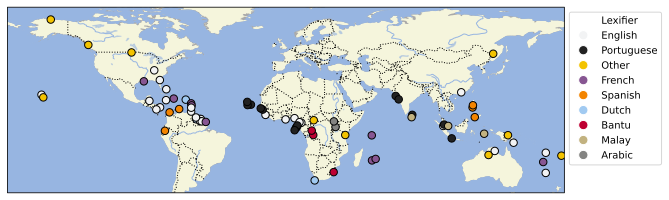

# Atlas of Pidgin and Creole Language Structures Online

## How to cite

If you use these data please cite
- the original source
  > Michaelis, Susanne Maria & Maurer, Philippe & Haspelmath, Martin & Huber, Magnus (eds.) 2013. Atlas of Pidgin and Creole Language Structures Online. Leipzig: Max Planck Institute for Evolutionary Anthropology.
- the derived dataset using the DOI of the [particular released version](../../releases/) you were using

## Description

This dataset is licensed under a CC-BY-4.0 license

Available online at https://apics-online.info/

### Overview

This dataset bundles the data of the *Atlas of Pidgin and Creole Language Structures* (APiCS),
originally published as a set of four books by Oxford University Press. It contains 
- the expert-coded grammatical and lexical features described in the printed Atlas [as CLDF StructureDataset](cldf/)
- the feature descriptions [as HTML pages and feature maps in Gall-Peters projection as PDF](cldf/Atlas)
- the surveys [as HTML pages](cldf/Survey)
- accompanying media such as the glossed texts provided with each survey or [audio files of spoken examples](cldf/Examples)

### Coverage

APiCS covers 76 pidgin and creole languages from around the world.

## CLDF Datasets

The following CLDF datasets are available in [cldf](cldf):

- CLDF [StructureDataset](https://github.com/cldf/cldf/tree/master/modules/StructureDataset) at [cldf/StructureDataset-metadata.json](cldf/StructureDataset-metadata.json)